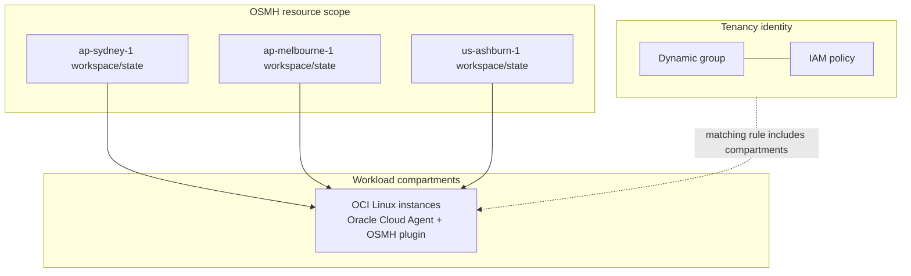

# OCI OS Management Hub Terraform

Terraform automation for Oracle Cloud Infrastructure OS Management Hub (OSMH) fleet patching. It turns tenancy instance inventory into regional OSMH software sources, managed instance groups, registration profiles, and scheduled patch jobs.

The stack is built for repeatable tenancy onboarding: one generated config per tenancy, one inventory CSV per tenancy, and one Terraform workspace/state per tenancy-region.

## What This Repository Adds

- CSV-to-OSMH config generation from OCI instance inventory
- Multi-tenancy inventory handling with `tenancy_instances.csv` style files
- Region-aware split logic based on instance OCIDs and inventory fields
- OCI SDK enrichment for real compartment names and instance display names
- Optional IAM dynamic group and policy creation for first-run tenancies
- Existing identity reuse mode to avoid duplicate dynamic groups or policies
- Regional OSMH software sources, managed instance groups, profiles, and scheduled jobs
- Agent status checks, optional agent enablement, and OSMH registration checks
- Scheduled job run helpers and work-request checks

## Companion Repo

For agent-assisted onboarding and operations workflows, this repo pairs with [`agent_orchestrator`](https://github.com/aszynkow/agent_orchestrator).

`oci_os_hub` remains standalone: you can generate configs, run Terraform, check agents, and run jobs directly from this repository. The orchestrator is optional and useful when you want a structured human-in-the-loop workflow for tenancy onboarding, region splitting, plan review, agent checks, scheduled jobs, and Cline/Codex verification.

## Run With Agent Orchestrator

Use the local orchestrator path and the OSMH onboarding skill:

```sh
python3 /Users/aszynkow/Documents/codex_project/repos/agent_orchestrator/orchestrator.py \
  --skill oci-osmh-tenancy-onboarding \
  run "Process tenancy apacanzset03child1 from anz_cloud_team_book_new.csv using repos/oci_os_hub. Split by region, enrich names from OCI, generate tenancy config, plan per tenancy-region workspace, reuse existing identity when present, and do not apply without approval."
```

The skill is intended to coordinate the same steps this README documents: generate a tenancy inventory, enrich OCI names, create the tenancy config, use the right Terraform workspace per region, check identity mode, plan/apply after approval, check agents, verify OSMH managed registration, and run scheduled jobs.

Useful copy/paste prompts:

**Full tenancy onboarding, with approval before changes**

```sh
python3 /Users/aszynkow/Documents/codex_project/repos/agent_orchestrator/orchestrator.py \
  --skill oci-osmh-tenancy-onboarding \
  run "For repo repos/oci_os_hub, process tenancy apacanzset03child1 from anz_cloud_team_book_new.csv. Split by real OCI region, generate terraform/config/apacanzset03child1_instances.csv, enrich compartment and instance names from OCI OCIDs read-only first, then generate terraform/config/apacanzset03child1_osmh_config.json. Use one Terraform workspace per tenancy-region named apacanzset03child1-<region>. Reuse existing identity if dynamic group and policy already exist; if they do not exist, prepare the first-run identity plan but do not apply without approval. Run terraform plan per region and show the result. Do not run terraform apply, enable agents, or run scheduled jobs until explicitly approved."
```

**Use existing identity only**

```sh
python3 /Users/aszynkow/Documents/codex_project/repos/agent_orchestrator/orchestrator.py \
  --skill oci-osmh-tenancy-onboarding \
  run "For repo repos/oci_os_hub, tenancy apacanzset03child1, validate and plan all configured regions using existing identity only. Do not create or modify dynamic groups or policies. Source the correct OCI profile per region, select the correct tenancy-region workspace, confirm the generated config uses existing identity mode, run terraform plan, and report any duplicate profiles, duplicate groups, missing software sources, or workspace/state mismatches."
```

**Check and enable agents after Terraform is applied**

```sh
python3 /Users/aszynkow/Documents/codex_project/repos/agent_orchestrator/orchestrator.py \
  --skill oci-osmh-tenancy-onboarding \
  run "For repo repos/oci_os_hub, tenancy apacanzset03child1, check OSMH agent status for all configured regions using terraform/scripts/osmh_agent_scan.py. Show the status first. If any agents are MISSING or DISABLED, enable them, then rerun the scan and show the final status per region."
```

**Run scheduled jobs only**

```sh
python3 /Users/aszynkow/Documents/codex_project/repos/agent_orchestrator/orchestrator.py \
  --skill oci-osmh-tenancy-onboarding \
  run "For repo repos/oci_os_hub, tenancy apacanzset03child1, only run existing scheduled OSMH jobs for the configured regions. Do not run terraform apply. Do not create or modify identity resources. Do not enable agents. Source the correct OCI profile/env per region, select the correct Terraform workspace for each tenancy-region, get existing scheduled job IDs from Terraform output/state, check for already-running work requests, then run terraform/scripts/run_osmh_jobs.py. Show final job status per region including job key, job OCID, lifecycle state, last run, next run, and any errors."
```

## Quick Start

From the repository root:

```sh
cd terraform
source scripts/source_oci_profile_tfvars.sh \
  apacanzset03child1 \
  ap-sydney-1 \
  config/apacanzset03child1_osmh_config.json

terraform init
terraform workspace new apacanzset03child1-ap-sydney-1 2>/dev/null || \
terraform workspace select apacanzset03child1-ap-sydney-1

terraform plan
```

Run `terraform apply` only after reviewing the plan and confirming the tenancy identity mode is correct.

## Config and State

| File | Tracked | Purpose |
| --- | --- | --- |
| `terraform/config/osmh_config.template.json` | Yes | Safe template for generated OSMH configs |
| `terraform/config/template_instances.csv` | Yes | Expected inventory CSV shape |
| `terraform/config/<tenancy>_instances.csv` | No | Generated local inventory for one tenancy |
| `terraform/config/<tenancy>_osmh_config.json` | No | Generated local OSMH config for one tenancy |
| `terraform/config/backup/` | No | Backups created by helper scripts |
| `terraform/terraform.tfvars` | No | Optional local Terraform variable file |

Key state rules:

- Use one Terraform workspace/state per tenancy-region, for example `apacanzset03child2-ap-melbourne-1`.
- Do not switch `TF_VAR_region` inside an existing regional state unless you intend Terraform to replace region-filtered OSMH resources in that state.
- Keep generated configs and real OCIDs out of Git unless you intentionally decide to track a sanitized example.
- The local branch may be ahead of remote while generated tenancy files remain untracked.

## Architecture



Identity is either created once for a new tenancy or reused when an existing dynamic group and policy are already present. Regional OSMH resources are managed separately so each region can be planned, applied, checked, and operated independently.

## Repository Layout

```text
.
├── LICENSE
├── README.md
├── anz_cloud_team_book_new.csv              # local/untracked source inventory when present
└── terraform
    ├── compartments.tf
    ├── identity.tf
    ├── locals.tf
    ├── osmh_groups.tf
    ├── osmh_profiles.tf
    ├── osmh_scheduled_jobs.tf
    ├── outputs.tf
    ├── provider.tf
    ├── software_sources.tf
    ├── variables.tf
    ├── versions.tf
    ├── terraform.tfvars.example
    ├── config/
    │   ├── osmh_config.template.json
    │   └── template_instances.csv
    └── scripts/
        ├── csv_to_osmh_config.py
        ├── enrich_instances_from_oci.py
        ├── osmh_agent_scan.py
        ├── osmh_managed_instance_status.py
        ├── run_osmh_jobs.py
        ├── source_oci_profile_tfvars.sh
        └── transform_anz_to_instances.py
```

## Tenancy Onboarding Workflow

1. Generate a tenancy-specific inventory from the multi-account CSV:

```sh
python3 terraform/scripts/transform_anz_to_instances.py \
  --source-csv anz_cloud_team_book_new.csv \
  --account-name apacanzset03child1 \
  --target-csv terraform/config/apacanzset03child1_instances.csv
```

2. Enrich generated names from OCI. Run read-only first for each region:

```sh
cd terraform
python3 scripts/enrich_instances_from_oci.py \
  --csv config/apacanzset03child1_instances.csv \
  --tenancy-name apacanzset03child1 \
  --region ap-sydney-1 \
  --profile apacanzset03child1
```

After reviewing the proposed name changes, update the CSV in place:

```sh
python3 scripts/enrich_instances_from_oci.py \
  --csv config/apacanzset03child1_instances.csv \
  --tenancy-name apacanzset03child1 \
  --region ap-sydney-1 \
  --profile apacanzset03child1 \
  --in-place
```

Repeat enrichment for every region in the tenancy inventory.

3. Generate the tenancy-specific OSMH config:

```sh
python3 scripts/csv_to_osmh_config.py \
  config/apacanzset03child1_instances.csv \
  --template config/osmh_config.template.json \
  --out config/apacanzset03child1_osmh_config.json
```

4. Source the OCI profile and Terraform variables for one region:

```sh
source scripts/source_oci_profile_tfvars.sh \
  apacanzset03child1 \
  ap-sydney-1 \
  config/apacanzset03child1_osmh_config.json
```

The helper reads `~/.oci/config` or `$OCI_CONFIG_FILE`, sets `OCI_CLI_PROFILE`, and exports the provider variables Terraform needs:

- `TF_VAR_tenancy_ocid`
- `TF_VAR_region`
- `TF_VAR_home_region`
- `TF_VAR_user_ocid`
- `TF_VAR_fingerprint`
- `TF_VAR_private_key_path`
- `TF_VAR_config_file`
- `TF_VAR_osmh_compartment_id`

Pass a fourth argument to override the OSMH resource compartment:

```sh
source scripts/source_oci_profile_tfvars.sh \
  apacanzset03child1 \
  ap-sydney-1 \
  config/apacanzset03child1_osmh_config.json \
  ocid1.compartment.oc1..xxxx
```

5. Select the tenancy-region workspace and plan:

```sh
terraform workspace new apacanzset03child1-${TF_VAR_region} 2>/dev/null || \
terraform workspace select apacanzset03child1-${TF_VAR_region}

terraform plan
```

6. Apply only after the plan is clean and identity handling is confirmed:

```sh
terraform apply
```

Repeat source, workspace, plan, and apply for each region in the tenancy inventory.

## Identity Mode

For a first run in a tenancy, Terraform can create the OSMH dynamic group and policy:

```json
"identity": {
  "enabled": true,
  "use_existing_dynamic_group": false,
  "create_policy": true,
  "dynamic_group_name": "osmh-instances"
}
```

For later regions, or for a tenancy where identity already exists, reuse identity instead of creating duplicates:

```json
"identity": {
  "enabled": true,
  "use_existing_dynamic_group": true,
  "existing_dynamic_group_id": "ocid1.dynamicgroup.oc1..xxxx",
  "create_policy": false,
  "dynamic_group_name": "osmh-instances"
}
```

With existing identity mode, Terraform does not create `oci_identity_dynamic_group.osmh_instances` and does not create `oci_identity_policy.osmh` when `create_policy` is false. Use this output to inspect the matching rule Terraform calculated:

```sh
terraform output identity_mode
```

If Terraform should manage an existing dynamic group, import it into the correct workspace first and leave `use_existing_dynamic_group = false`:

```sh
terraform import 'oci_identity_dynamic_group.osmh_instances[0]' ocid1.dynamicgroup.oc1..xxxx
terraform plan
```

## Software Sources, Groups, Profiles, and Jobs

The generated config defines `osmh.software_sources`, managed instance groups, registration profiles, and scheduled jobs. Managed instance groups reference software sources by key, for example:

```json
"software_source_keys": [
  "ol8_x86_baseos_sydney",
  "ol8_x86_appstream_sydney"
]
```

Terraform validates that every group `software_source_keys` entry exists in `osmh.software_sources`. If a plan fails with an empty `local.software_source_ids_by_key`, check that the generated config contains software sources for the selected region and that the workspace is using the correct `TF_VAR_config_file`.

Vendor sources are looked up from OCI. Custom sources can be created when source creation is enabled:

```hcl
enable_source_creation = true
```

Set this to false when all software sources already exist and should only be looked up:

```hcl
enable_source_creation = false
```

## Agent Checks

Check Oracle Cloud Agent OSMH plugin status for the selected region:

```sh
cd terraform
source scripts/source_oci_profile_tfvars.sh \
  apacanzset03child1 \
  ap-sydney-1 \
  config/apacanzset03child1_osmh_config.json

python3 scripts/osmh_agent_scan.py \
  --config config/apacanzset03child1_osmh_config.json \
  --region ap-sydney-1
```

Enable missing or disabled OSMH plugins only when you are ready to change OCI instances:

```sh
python3 scripts/osmh_agent_scan.py \
  --config config/apacanzset03child1_osmh_config.json \
  --region ap-sydney-1 \
  --enable
```

Check which instances OSMH actually sees as managed:

```sh
python3 scripts/osmh_managed_instance_status.py \
  --config config/apacanzset03child1_osmh_config.json \
  --region ap-sydney-1 \
  --show-extra
```

## Scheduled Jobs

Preview scheduled jobs from Terraform output without running them:

```sh
python3 scripts/run_osmh_jobs.py --region ap-sydney-1 --dry-run
```

Check for currently running OSMH work requests across configured compartments:

```sh
python3 scripts/run_osmh_jobs.py \
  --config config/apacanzset03child1_osmh_config.json \
  --region ap-sydney-1 \
  --list-running
```

Run all scheduled jobs for the selected region:

```sh
python3 scripts/run_osmh_jobs.py \
  --config config/apacanzset03child1_osmh_config.json \
  --region ap-sydney-1
```

Run a single job by Terraform output key:

```sh
python3 scripts/run_osmh_jobs.py \
  --region ap-sydney-1 \
  --job-key sydney_ol8_x86_weekly_upgrade
```

## Common Commands

```sh
# Generate inventory for one tenancy
python3 terraform/scripts/transform_anz_to_instances.py --source-csv anz_cloud_team_book_new.csv --account-name apacanzset03child1 --target-csv terraform/config/apacanzset03child1_instances.csv

# Generate config from inventory
cd terraform
python3 scripts/csv_to_osmh_config.py config/apacanzset03child1_instances.csv --template config/osmh_config.template.json --out config/apacanzset03child1_osmh_config.json

# Source OCI profile and Terraform vars
source scripts/source_oci_profile_tfvars.sh apacanzset03child1 ap-sydney-1 config/apacanzset03child1_osmh_config.json

# Workspace and plan
terraform workspace new apacanzset03child1-ap-sydney-1 2>/dev/null || terraform workspace select apacanzset03child1-ap-sydney-1
terraform plan

# Agent and registration checks
python3 scripts/osmh_agent_scan.py --config config/apacanzset03child1_osmh_config.json --region ap-sydney-1
python3 scripts/osmh_managed_instance_status.py --config config/apacanzset03child1_osmh_config.json --region ap-sydney-1 --show-extra

# Scheduled job checks
python3 scripts/run_osmh_jobs.py --config config/apacanzset03child1_osmh_config.json --region ap-sydney-1 --list-running
python3 scripts/run_osmh_jobs.py --config config/apacanzset03child1_osmh_config.json --region ap-sydney-1 --dry-run
```

## Troubleshooting

- If Terraform wants to recreate regional resources, confirm you selected the correct tenancy-region workspace and sourced the correct `TF_VAR_region` and `TF_VAR_config_file`.
- If profile or managed group names already exist, import the existing resources or use the correct existing workspace/state instead of creating a new stack.
- If dynamic group quota is reached, reuse or import the existing OSMH dynamic group rather than creating another one.
- If agents show `NO_INSTANCE_ID`, regenerate or enrich the tenancy CSV so `instance_id` values are present.
- If jobs are not found from Terraform output, confirm the workspace is the one that created those jobs. You can also list scheduled jobs directly in OCI by region/compartment to verify last execution times.
- If OCI CLI warns that an API key is missing the `OCI_API_KEY` label, append `OCI_API_KEY` as the final line of the private key file and keep permissions at `600`.

## Credits

This repository contains OCI OS Management Hub Terraform automation and operational helpers by **Adam Szynkowski** ([@aszynkow](https://github.com/aszynkow)).

Release notes for the Terraform automation are tracked in [CHANGELOG.md](CHANGELOG.md).

## License

This project follows the license in [LICENSE](LICENSE).
