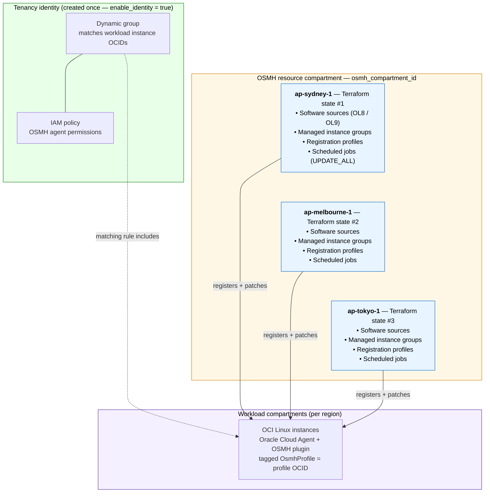

# OCI OS Management Hub Terraform

Terraform to bootstrap OCI OS Management Hub for Linux patching. The Terraform
stack lives under `terraform/` and reads a local generated config at
`terraform/config/osmh_config.json`. It creates:

- IAM dynamic group and policy for OSMH-managed OCI instances.
- OS Management Hub software sources.
- OS Management Hub managed instance groups.
- OS Management Hub registration profiles.
- OS Management Hub scheduled jobs, for example `UPDATE_ALL`, which is the
  OSMH equivalent of fleet `dnf upgrade`.

The committed template is `terraform/config/osmh_config.template.json`. Keep
real inventory and OCIDs in the generated local file
`terraform/config/osmh_config.json`, which is ignored by Git.
The committed CSV shape example is `terraform/config/template_instances.csv`.

Terraform now blocks applies when placeholder OCIDs remain. Pass the central
OSMH resource compartment with `-var='osmh_compartment_id=<compartment_ocid>'`
or `TF_VAR_osmh_compartment_id`. Workload compartment OCIDs can come from the
CSV/fleet inventory `compartment_id` column. The CSV helper populates the
`compartments` map, `identity.managed_compartment_names`, and `fleet.instances`
from the CSV. If the CSV/fleet value is missing, Terraform attempts to look up
each `identity.managed_compartment_names` entry by compartment name across the
tenancy.

## Architecture



Key points:

- **Identity is created once** (in the first region's apply with
  `enable_identity = true`). All other regional applies pass
  `enable_identity = false` so they reuse the same dynamic group and policy.
- If a dynamic group already exists outside this Terraform state, set
  `identity.use_existing_dynamic_group = true` and optionally
  `identity.create_policy = false`. Terraform will not create duplicate IAM
  resources and will output the desired matching rule for import or manual
  update of the existing group.
- All OSMH resources live in the **central OSMH compartment**
  (`osmh_compartment_id`). Workload **instances** stay in their own
  compartments and are pulled into the dynamic group by matching rule.
- Each region is its own Terraform state, so adding a region is "another
  apply" — never a `region` switch inside an existing state.

## Layout

```text
.
├── LICENSE
├── README.md
└── terraform
    ├── config/osmh_config.template.json
    ├── config/template_instances.csv
    ├── identity.tf
    ├── locals.tf
    ├── osmh_groups.tf
    ├── osmh_profiles.tf
    ├── osmh_scheduled_jobs.tf
    ├── outputs.tf
    ├── provider.tf
    ├── software_sources.tf
    ├── scripts/csv_to_osmh_config.py
    ├── terraform.tfvars.example
    ├── variables.tf
    └── versions.tf
```

## Workflow

1. Clone the repository and enter it:

```sh
git clone https://github.com/aszynkow/oci_os_hub.git
cd oci_os_hub
```

2. Export the OCI provider credentials so Terraform can authenticate. Use the
   secrets store / dotfile of your choice — the stack only needs these
   `TF_VAR_*` variables in your shell:

```sh
export TF_VAR_tenancy_ocid=ocid1.tenancy.oc1..xxxx
export TF_VAR_user_ocid=ocid1.user.oc1..xxxx
export TF_VAR_fingerprint=aa:bb:cc:dd:...
export TF_VAR_private_key_path=$HOME/.oci/oci_api_key.pem
export TF_VAR_region=ap-sydney-1
```

3. Export the OCI instance list to `terraform/config/apacanzset03_instances.csv`. Use
   `terraform/config/template_instances.csv` as the column template if needed.
4. Generate your local config from the tracked template:

```sh
cd terraform
python3 scripts/csv_to_osmh_config.py config/apacanzset03_instances.csv --template config/osmh_config.template.json --out config/osmh_config.json
```

5. Keep real values in `terraform/config/osmh_config.json` only. It is ignored
   by Git. Edit it locally if you need to adjust schedules, software sources,
   managed instance groups, or profiles.
6. Set the central OSMH resource compartment (`osmh_compartment_id`). Terraform
   blocks applies while this is a placeholder. Pick **one** of the following:

   - As an environment variable (matches the other `TF_VAR_*` exports above):

     ```sh
     export TF_VAR_osmh_compartment_id=ocid1.compartment.oc1..xxxx
     ```

   - As a `terraform.tfvars` file, if you don't already have one. Copy the
     tracked example and fill in real values:

     ```sh
     cd terraform
     cp terraform.tfvars.example terraform.tfvars
     # then edit terraform.tfvars and uncomment osmh_compartment_id
     ```

     `terraform.tfvars` is ignored by Git, so it is safe to keep real OCIDs in
     it locally.

   - Or pass it inline on every Terraform command:

     ```sh
     terraform apply -var='osmh_compartment_id=ocid1.compartment.oc1..xxxx' -var='region=ap-sydney-1'
     ```

7. Run one Terraform state per OCI region:

```sh
cd terraform
terraform init
terraform plan  -var='region=ap-sydney-1'
terraform apply -var='region=ap-sydney-1'
terraform apply -var='region=ap-melbourne-1' -var='enable_identity=false'
terraform apply -var='region=ap-tokyo-1'     -var='enable_identity=false'
```

Use separate Resource Manager stacks, workspaces, or state backends per region.
Do not switch `region` inside the same state unless you intend Terraform to
replace the region-filtered OSMH resources in that state.

## Software Sources

By default, the stack uses `osmh.software_sources` in
`terraform/config/osmh_config.json` to resolve source IDs:

```hcl
enable_source_creation = true
```

Entries with `software_source_type = "VENDOR"` are Oracle-provided sources, so
Terraform looks them up and attaches their IDs. Non-vendor entries are created
when source creation is enabled.

For vendor sources, Terraform also asserts `availability_at_oci = "SELECTED"`
before creating managed instance groups. This handles regions where the vendor
source exists but has not yet been selected for the tenancy.

Each managed instance group uses `software_source_keys` to reference those
sources. For example, the Sydney Oracle Linux 8 group references:

```json
"software_source_keys": [
  "ol8_x86_baseos_sydney",
  "ol8_x86_appstream_sydney"
]
```

If software sources already exist and you only want Terraform to look them up,
set:

```hcl
enable_source_creation = false
```

In lookup mode, Terraform uses each source's `lookup` block if present, or falls
back to the source `display_name`, `compartment_id`, and `software_source_type`.

## Running Scheduled Jobs

After Terraform creates the scheduled jobs, trigger all jobs for the selected
region with:

```sh
cd terraform
python3 scripts/run_osmh_jobs.py --region ap-sydney-1
```

Preview the jobs without running them:

```sh
python3 scripts/run_osmh_jobs.py --region ap-sydney-1 --dry-run
```

Run one job by Terraform output key:

```sh
python3 scripts/run_osmh_jobs.py --region ap-sydney-1 --job-key sydney_ol8_x86_weekly_upgrade
```

Check for currently running OSMH work requests across all compartments in
`config/osmh_config.json`:

```sh
python3 scripts/run_osmh_jobs.py --region ap-sydney-1 --list-running
```

## Partial Apply Recovery

If an early apply created IAM resources before failing on OSMH resources, do not
delete the state. Replace the placeholder compartment IDs, then run apply again.
Terraform will update the dynamic group matching rule and continue creating the
OSMH resources.

Check what was created:

```sh
cd terraform
terraform state list
```

At minimum, these values must be real OCIDs before apply:

- `osmh.compartment_id`, `TF_VAR_osmh_compartment_id`, or
  `-var='osmh_compartment_id=<compartment_ocid>'`
- every fleet `compartment_id` used to build the dynamic group matching rule

The top-level `compartments` map is optional when `fleet.instances` contains
real `compartment_name` and `compartment_id` values from the CSV. If both the
top-level map and fleet IDs are missing, Terraform will try an OCI compartment
lookup by name. If names are duplicated in the tenancy, provide the exact OCID
in `compartments` or in the fleet CSV.

## Existing Instances

For existing OCI instances:

1. Confirm Oracle Cloud Agent is installed and at least version `1.40`.
2. Enable the `OS Management Hub Agent` plugin.
3. Select the matching profile created by this Terraform.

You can scan the JSON fleet and optionally enable the plugin with:

```sh
cd terraform
python3 scripts/osmh_agent_scan.py --region ap-sydney-1
```

The scan reads `config/osmh_config.json`, resolves missing compute instance
OCIDs by `display_name` and `compartment_id`, and reports the Oracle Cloud
Agent plugin state. To attach the matching Terraform-created OSMH profile and
enable the plugin where needed:

```sh
cd terraform
python3 scripts/osmh_agent_scan.py --region ap-sydney-1 --enable
```

After enabling, wait a few minutes and rerun the scan. Registered instances
should then appear in OS Management Hub and in the target managed instance
groups.

For new instances, OCI also supports assigning a profile with the free-form tag:

```text
OsmhProfile = <profile_ocid>
```

The `profile_ids` output gives the values to use.

## Environment Variables

You can source Terraform and OCI CLI environment values from an OCI CLI profile instead of exporting them by hand:

```sh
cd terraform
source scripts/source_oci_profile_tfvars.sh apacanzset03child3 auto config/apacanzset03child3_osmh_config.json
terraform workspace select apacanzset03child3-ap-sydney-1
terraform plan
```

The helper reads `~/.oci/config` or `$OCI_CONFIG_FILE`, sets
`OCI_CLI_PROFILE` for Python/OCI CLI helpers, and exports the matching
Terraform `TF_VAR_*` provider variables. Pass `auto` as the region to read the
single region from `config/<profile>_instances.csv`. If that file contains
multiple regions, source the helper once per region and pass the region
explicitly. The profile's configured OCI region is exported as
`TF_VAR_home_region` and is used for IAM resources such as dynamic groups and
policies.

The optional fourth argument sets the OSMH resource compartment override:

```sh
source scripts/source_oci_profile_tfvars.sh \
  apacanzset03child3 \
  auto \
  config/apacanzset03child3_osmh_config.json \
  ocid1.compartment.oc1..xxxx
```

If the fourth argument is omitted, `TF_VAR_osmh_compartment_id` defaults to the
tenancy OCID from the OCI profile. You can also set `OSMH_COMPARTMENT_ID` or
`TF_VAR_osmh_compartment_id` before sourcing the helper.

The stack reads its OCI provider credentials from these `TF_VAR_*` environment
variables (see the Workflow section for example `export` commands):

- `TF_VAR_tenancy_ocid`
- `TF_VAR_region`
- `TF_VAR_home_region`
- `TF_VAR_user_ocid`
- `TF_VAR_fingerprint`
- `TF_VAR_private_key_path`
- `TF_VAR_osmh_compartment_id`

Any other `TF_VAR_*` values you export for unrelated stacks (Exadata, subnet,
SSH, admin password, etc.) are ignored by this Terraform.

## Tenancy-Specific Plan-Only Workflow

Use this flow when onboarding another account such as `apacanzset03child3`
without applying Terraform or making OCI changes.

1. Generate the tenancy-specific inventory from the multi-account source CSV:

```sh
python3 terraform/scripts/transform_anz_to_instances.py \
  --source-csv anz_cloud_team_book_new.csv \
  --account-name apacanzset03child3 \
  --target-csv terraform/config/apacanzset03child3_instances.csv
```

2. Generate a tenancy-specific OSMH config from that inventory:

```sh
cd terraform
python3 scripts/csv_to_osmh_config.py \
  config/apacanzset03child3_instances.csv \
  --template config/osmh_config.template.json \
  --out config/apacanzset03child3_osmh_config.json
```

3. Source the OCI profile and let the helper pick the region from
   `config/apacanzset03child3_instances.csv`:

```sh
export OCI_CONFIG_FILE=/Users/aszynkow/.oci/config

source scripts/source_oci_profile_tfvars.sh \
  apacanzset03child3 \
  auto \
  config/apacanzset03child3_osmh_config.json
```

To place OSMH resources in a specific compartment instead of the tenancy/root
scope, pass that compartment OCID as the fourth argument:

```sh
source scripts/source_oci_profile_tfvars.sh \
  apacanzset03child3 \
  auto \
  config/apacanzset03child3_osmh_config.json \
  ocid1.compartment.oc1..xxxx
```

4. Select or create a workspace for the region and run **plan only**:

```sh
terraform workspace new apacanzset03child3-${TF_VAR_region} 2>/dev/null || \
terraform workspace select apacanzset03child3-${TF_VAR_region}

terraform plan
```

Do not run `terraform apply` during this prep workflow. If
`config/apacanzset03child3_instances.csv` contains more than one region, repeat
the source, workspace, and plan steps once per region.

## Existing Dynamic Group

If the tenancy already has an OSMH dynamic group and policy, avoid creating
duplicates by setting these values in the generated config:

```json
"identity": {
  "enabled": true,
  "use_existing_dynamic_group": true,
  "existing_dynamic_group_id": "ocid1.dynamicgroup.oc1..xxxx",
  "create_policy": false,
  "dynamic_group_name": "osmh-instances"
}
```

With this mode, Terraform does not create
`oci_identity_dynamic_group.osmh_instances` and does not create
`oci_identity_policy.osmh` when `create_policy` is false. The `identity_mode`
output shows the matching rule Terraform calculated from the fleet
compartments:

```sh
terraform output identity_mode
```

To let Terraform update the existing dynamic group matching rule, import it
into the current workspace/state first and leave
`use_existing_dynamic_group = false`:

```sh
terraform import 'oci_identity_dynamic_group.osmh_instances[0]' ocid1.dynamicgroup.oc1..xxxx
terraform plan
```

If you keep `use_existing_dynamic_group = true`, update the existing dynamic
group outside Terraform using the `identity_mode.matching_rule` output.

## Unsupported Instances From The Attachment

The config marks unsupported or special cases in `fleet.instances[*].osmh`:

- `k8sworker2` is Rocky Linux 8. Use Ansible or OCI Run Command for that host.
- `ragllm` is Oracle Autonomous Linux. Treat it separately from standard OSMH
  groups unless you intentionally configure Autonomous Linux resources.

## CSV Conversion Helper

If you export the OCI instance list as CSV, generate the local config from the
tracked template:

```sh
cd terraform
python3 scripts/csv_to_osmh_config.py config/apacanzset03_instances.csv --template config/osmh_config.template.json --out config/osmh_config.json
```

The expected CSV columns are shown in
`terraform/config/template_instances.csv`. The real `config/apacanzset03_instances.csv`
export is ignored by Git.

This populates:

- `compartments`
- `identity.managed_compartment_names`
- `fleet.instances`

with values from the CSV, including real `compartment_id` values. To refresh an
existing local config while keeping its non-inventory settings:

```sh
python3 scripts/csv_to_osmh_config.py config/apacanzset03_instances.csv --merge-config config/osmh_config.json --in-place
```

To generate a standalone inventory JSON file instead, omit `--template` and
`--merge-config`:

```sh
python3 scripts/csv_to_osmh_config.py config/apacanzset03_instances.csv --out fleet_from_csv.json
```
